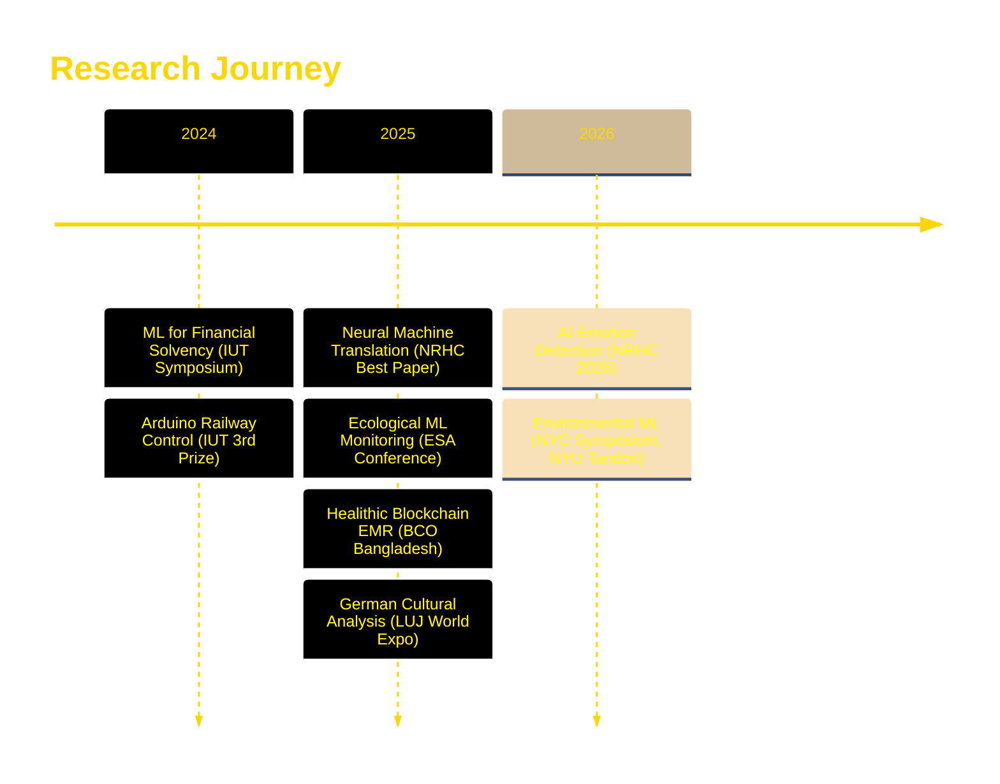

```markdown
<div align="center">


<h3>
  
</h3>

### 🎓 Triple Major: CS • Math • Business | 🌍 Global Researcher | 🏆 NASA Global Nominee (2x)

[](https://git.io/typing-svg)

</div>

---

## 🌟 Current Focus

```yaml
🔬 Research: Neural Machine Translation for Medical & Legal Equity
🤖 Building: Blockchain-Secured Healthcare Systems & Geospatial AI
🌱 Learning: Advanced ML Ethics, Cross-Cultural Tech Policy
💡 Goals: Democratizing AI access while preserving human agency
```

---

## 🏆 Recent Triumphs

<table>
<tr>
<td width="50%">

### 🥇 Technical Excellence
- 🚀 **NASA Space Apps Global Nominee** (2024 & 2025)
- 🏅 **Columbia Ivy League DevFest Winner**
- 🎯 **Xylem Global Challenge 1st Place** (800+ teams)
- 🏆 **NRHC Best Paper of the Year**

</td>
<td width="50%">

### 🌍 Global Impact
- 📊 Framework adopted by **3 medical institutions**
- 👨‍🏫 Mentored **120+ students** in STEM
- 🌐 Presented in **USA, Japan, Bangladesh**
- 📈 **300%** increase in robotics participation

</td>
</tr>
</table>

---

## 💻 Tech Arsenal

<div align="center">

### Languages & Frameworks


### AI & Machine Learning


### Blockchain & Web3


### Full-Stack Development


</div>

---

## 📊 GitHub Analytics

<div align="center">
  
  
</div>

<div align="center">
  
</div>

---

## 🎯 Featured Projects

<table>
<tr>
<td width="50%">

### 🌊 [RESQMAP](https://res-q-eosin.vercel.app/)
AI-powered flood rescue system using geospatial ML
> **Impact:** Won Xylem Global Challenge (800+ teams)

**Tech:** Python • Machine Learning • GIS

</td>
<td width="50%">

### 🔐 [Healithic](https://jzaman2004.github.io/Blockchain-Medical-Record/)
Blockchain-secured patient-controlled EMR system
> **Impact:** GDPR/HIPAA-compliant health sovereignty

**Tech:** Ethereum • IPFS • AES-256 • Web3

</td>
</tr>
<tr>
<td width="50%">

### 🌿 [Forager on the Go](https://devpost.com/software/forager-on-the-go-gs9f8m)
AI species identification for sustainable foraging
> **Impact:** Columbia DevFest "Hot Sauce" Winner

**Tech:** ResNet • Llama • Computer Vision

</td>
<td width="50%">

### 🪐 [NASA Orrery](https://jzaman2004.github.io/NASA-Neon-Syntax/)
Interactive 3D celestial mechanics visualization
> **Impact:** NASA Space Apps Global Nominee

**Tech:** Three.js • NASA Data API • WebGL

</td>
</tr>
</table>

---

## 📚 Research Publications



---

## 🌍 Global Footprint

```geojson
{
  "type": "FeatureCollection",
  "features": [
    {
      "type": "Feature",
      "properties": {
        "marker-symbol": "university",
        "title": "New York, USA",
        "description": "Columbia DevFest Winner • NYAS Scientist-in-Residence"
      },
      "geometry": {
        "type": "Point",
        "coordinates": [-73.9442, 40.6782]
      }
    },
    {
      "type": "Feature",
      "properties": {
        "marker-symbol": "star",
        "title": "Tokyo, Japan",
        "description": "Study Abroad • LUJ World Expo Presenter"
      },
      "geometry": {
        "type": "Point",
        "coordinates": [139.6917, 35.6895]
      }
    },
    {
      "type": "Feature",
      "properties": {
        "marker-symbol": "rocket",
        "title": "Dhaka, Bangladesh",
        "description": "BUET Silver Medalist • IUT Research Winner"
      },
      "geometry": {
        "type": "Point",
        "coordinates": [90.4125, 23.8103]
      }
    }
  ]
}
```

---

## 🎨 Philosophy

<div align="center">

> ### *"True innovation emerges when technical excellence serves human dignity."*


</div>

---

## 📫 Let's Collaborate

<div align="center">

[](https://jawadzaman.com)
[](mailto:jzaman2004@gmail.com)
[](https://www.linkedin.com/in/jawad-zaman-53874b291/)
[](https://github.com/Jzaman2004)

</div>

---

<div align="center">

### 💡 Open to Research Collaborations • Speaking Engagements • Mentorship Opportunities


</div>

<!-- Activity Graph -->
<div align="center">
  
</div>

---

<div align="center">

**Built with 💛 by Jawad Zaman • Last Updated: February 2026**


</div>
```
